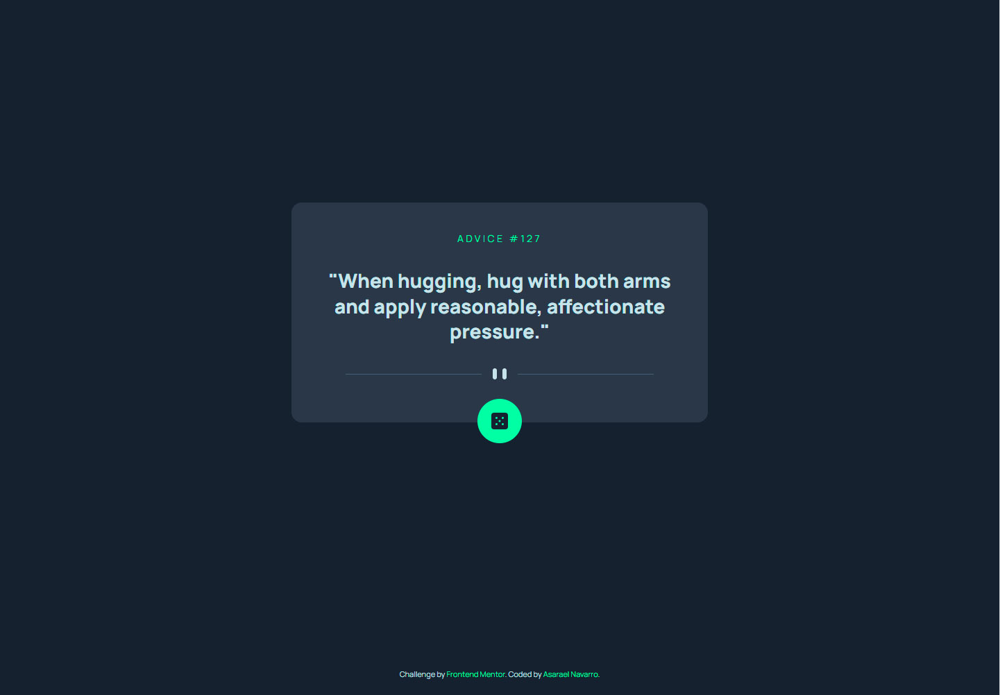

# Frontend Mentor - Advice generator app solution

This is a solution to the [Advice generator app challenge on Frontend Mentor](https://www.frontendmentor.io/challenges/advice-generator-app-QdUG-13db). Frontend Mentor challenges help you improve your coding skills by building realistic projects.

## Table of contents

- [Frontend Mentor - Advice generator app solution](#frontend-mentor---advice-generator-app-solution)
  - [Table of contents](#table-of-contents)
  - [Overview](#overview)
    - [The challenge](#the-challenge)
    - [Screenshot](#screenshot)
    - [Links](#links)
  - [My process](#my-process)
    - [Built with](#built-with)
    - [Useful resources](#useful-resources)
  - [Author](#author)

## Overview

### The challenge

Users should be able to:

- View the optimal layout for the app depending on their device's screen size
- See hover states for all interactive elements on the page
- Generate a new piece of advice by clicking the dice icon

### Screenshot

### Links

- Solution URL: [Add solution URL here](https://github.com/AsaraelNavarro/advice-generator-app.git)
- Live Site URL: [Add live site URL here](https://asaraelnavarro.github.io/advice-generator-app/)

## My process

### Built with

- Semantic HTML5 markup
- CSS custom properties
- Flexbox
- Js

### Useful resources

- [Working with API's](https://youtu.be/2Xm9P_tXtK8) - Usefull to understand how to use API's.

## Author

- Website - [Asarael Navarro](https://asarael-resume.herokuapp.com/)
- Frontend Mentor - [@AsaraelNavarro](https://www.frontendmentor.io/profile/AsaraelNavarro)
- Twitter - [@saulo_navarro](https://twitter.com/saulo_navarro)
